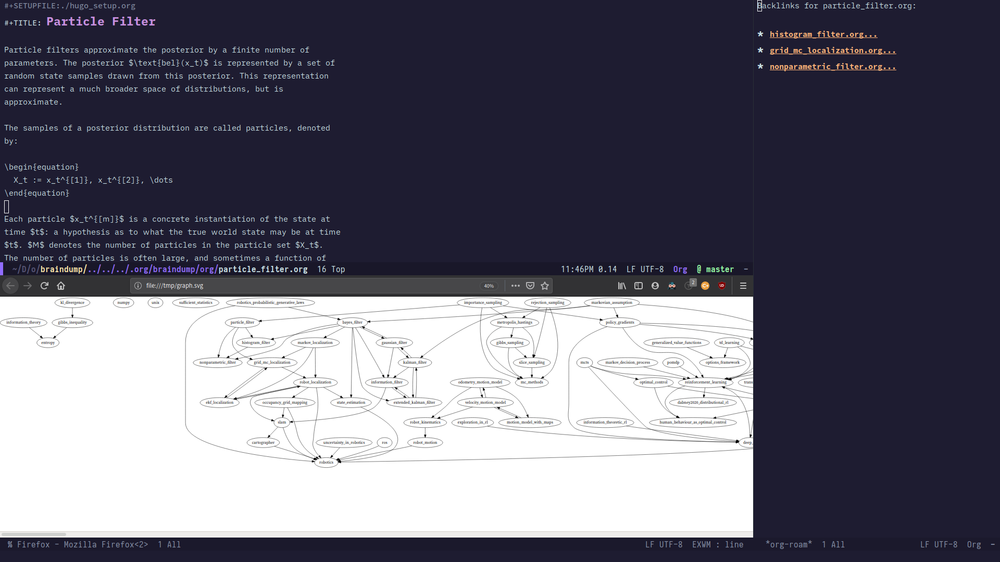

# Org-roam

Org-roam is a rudimentary [Roam](https://roamresearch.com/) replica in
Org-mode. This project intends to adaptively implement the core
features of Roam in org-mode and eventually introduce newer features
suitable for the Emacs ecosystem. It offers a **non-hierarchical**
note-taking approach which is **effortless** yet powerful. Note-taking
becomes fluent and easy when you don't have to worry about *where* a
particular note should go: you just start writing from anywhere about
anything.

To learn more about Roam, I recommend the following links:

-   [Building a second brain in Roam](https://reddit.com/r/RoamResearch/comments/eho7de/building_a_second_brain_in_roamand_why_you_might)
-   [Roam: Why I Love It and How I Use It](https://www.nateliason.com/blog/roam)

It is difficult to explain the workflow in words, so the best way to
figure out whether this is for you is to try it.

## Project Status

As of February 2020, it is in a very early stage of development. 

## A Preview

Here's a screenshot of `org-roam`. The `org-roam` buffer shows
backlinks for the active org buffer in the left window, as well as the
surrounding content in the backlink file. The backlink database is
built asynchronously in the background, and is not noticeable to the
end user. The graph is generated from the link structure, and can be
used to navigate to the respective files.



## Installation

You should first have [deft](https://jblevins.org/projects/deft/)
setup properly. This is only necessary now, and I intend to move away
from it once it becomes clearer what org-roam should be presenting.

```
(use-package deft
      :after org
      :bind
      ("C-c n d" . deft)
      :custom
      (deft-recursive t)
      (deft-use-filter-string-for-filename t)
      (deft-default-extension "org")
      (deft-directory "~/org-files/")
      (deft-use-filename-as-title t))
```

You can then setup org-roam as follows. The recommended method is
using [use-package](https://github.com/jwiegley/use-package) and
[straight](https://github.com/raxod502/straight.el), or a similar
package manager.

```
(use-package org-roam
      :after deft org
      :hook (org-mode . org-roam-mode)
      :straight (:host github :repo "jethrokuan/org-roam")
      :bind
      ("C-c n l" . org-roam)      
      ("C-c n t" . org-roam-today)
      ("C-c n f" . org-roam-find-file)
      ("C-c n i" . org-roam-insert)
      ("C-c n g" . org-roam-show-graph))
```

If not using package.el, you can also clone it into your Emacs
directory and add it to your load path:

```
git clone https://github.com/jethrokuan/org-roam/ ~/.emacs.d/elisp/org-roam
```

```
(add-to-list 'load-path "./elisp")
(require 'org-roam)
```

## Quickstart

Suppose you want to keep track of all the cool-facts you come across.

1. Open a deft file and start writing about anything. You can choose
   to jot it in your daily file with `org-roam-today`, or pick a file
   using the deft interface. Anywhere near your cool fact, run `M-x
   org-roam-insert` and choose the filename `cool-facts` and then keep
   on writing whatever you want. You can choose to create existing
   files, or create a new file if necessary.
2. When you open `cool-facts.org` and call `org-roam` you will
   see all the places you have referenced this file. So all the
   cool-facts you have writen anywhere in your deft database are
   easily accessible from here.
3. Note that `cool-facts.org` doesn't even have to contain any
   content: it can just be used as an index page for referencing all
   cool facts that you've written across your notes!

## Knowledge Bases using Org-Roam

- [Jethro Kuan](https://braindump.jethro.dev/)
  ([Source](https://github.com/jethrokuan/braindump/tree/master/org))

## Similar Projects

- [org-zettelkasten](https://github.com/l3kn/org-zettelkasten)
- [zetteldeft](https://github.com/EFLS/zetteldeft)

The main differentiating factor of this project is that links are just
natural file links, with no dependence on special tagging with e.g.
org IDs, or special indicators. This constraints the utility of the
project, but I have thus far found it sufficient.

## Contributing

Pull requests with improvements are welcome. For feature requests,
create Github issues.

