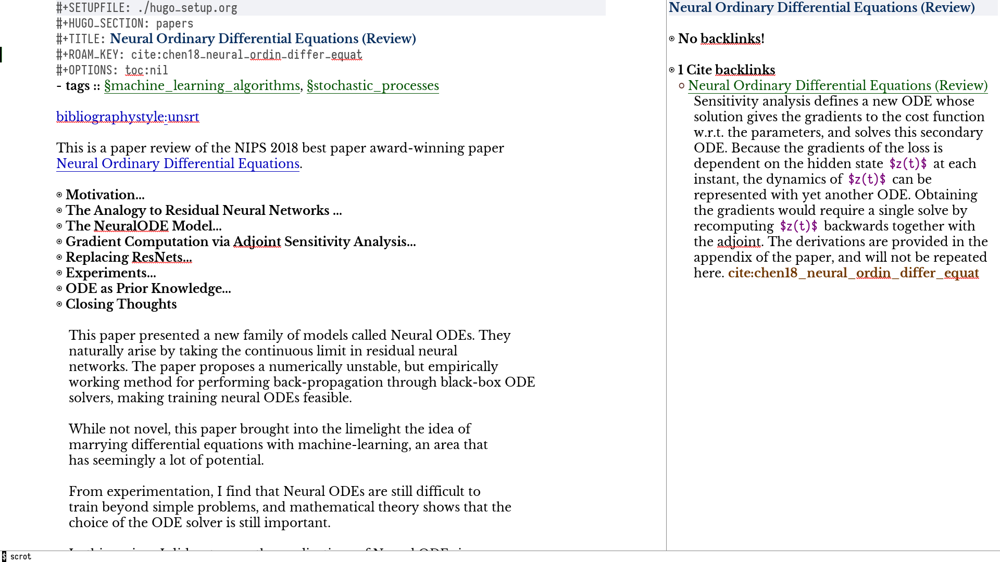

The bulk of Org-roam's functionality is built on top of vanilla
Org-mode. However, to support additional functionality, Org-roam adds
several Org-roam-specific keywords. These functionality are not
crucial to effective use of Org-roam.

## File Aliases

Suppose you want a note to be referred to by different names (e.g.
"World War 2", "WWII"). You may specify such aliases using the
`#+ROAM_ALIAS` attribute:

```org
#+TITLE: World War 2
#+ROAM_ALIAS: "WWII" "World War II"
```


## File Refs

Refs are unique identifiers for files. Each note can only have 1 ref.
For example, a note for a website may contain a ref:

```org
#+TITLE: Google
#+ROAM_KEY: https://www.google.com/
```

These keys come in useful for when taking website notes, using the
`roam-ref` protocol (see [Roam Protocol](roam_protocol.md)).

Alternatively, add a ref for notes for a specific paper, using its
[org-ref](https://github.com/jkitchin/org-ref) citation key:

```org
#+TITLE: Neural Ordinary Differential Equations
#+ROAM_KEY: cite:chen18_neural_ordin_differ_equat
```

The backlinks buffer will show any cites of this key: e.g.


