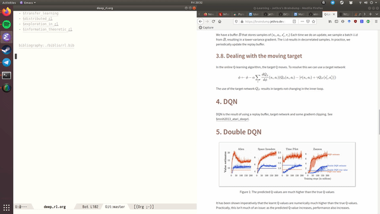

A number of packages work well combined with Org-Roam:

## Deft

[Deft][deft] provides a nice interface for browsing and filtering
org-roam notes.

```emacs-lisp
(use-package deft
  :after org
  :bind
  ("C-c n d" . deft)
  :custom
  (deft-recursive t)
  (deft-use-filter-string-for-filename t)
  (deft-default-extension "org")
  (deft-directory "/path/to/org-roam-files/"))
```

If the title of the Org file is not the first line, you might not get
nice titles. You may choose to patch this to use `org-roam`'s
functionality. Here I'm using [el-patch](https://github.com/raxod502/el-patch):

```emacs-lisp
(use-package el-patch
  :straight (:host github
                   :repo "raxod502/el-patch"
                   :branch "develop"))

(eval-when-compile
  (require 'el-patch))

(use-package deft
  ;; same as above...
  :config/el-patch
  (defun deft-parse-title (file contents)
    "Parse the given FILE and CONTENTS and determine the title.
If `deft-use-filename-as-title' is nil, the title is taken to
be the first non-empty line of the FILE.  Else the base name of the FILE is
used as title."
    (el-patch-swap (if deft-use-filename-as-title
                       (deft-base-filename file)
                     (let ((begin (string-match "^.+$" contents)))
                       (if begin
                           (funcall deft-parse-title-function
                                    (substring contents begin (match-end 0))))))
                   (org-roam--get-title-or-slug file))))
```

The Deft interface can slow down quickly when the number of files get
huge. [Notdeft][notdeft] is a fork of Deft that uses an external
search engine and indexer.

## Org-journal

[Org-journal](https://github.com/bastibe/org-journal) is a more powerful
alternative to the simple function `org-roam-dailies-today`. It provides better
journaling capabilities, and a nice calendar interface to see all dated entries.

```emacs-lisp
(use-package org-journal
  :bind
  ("C-c n j" . org-journal-new-entry)
  :custom
  (org-journal-date-prefix "#+TITLE: ")
  (org-journal-file-format "%Y-%m-%d.org")
  (org-journal-dir "/path/to/org-roam-files/")
  (org-journal-date-format "%A, %d %B %Y"))
```

## Note-taking Add-ons

These are some plugins that make note-taking in Org-mode more
enjoyable.

### Org-download

[Org-download][org-download] lets you screenshot and yank images from
the web into your notes:


```emacs-lisp
(use-package org-download
  :after org
  :bind
  (:map org-mode-map
        (("s-Y" . org-download-screenshot)
         ("s-y" . org-download-yank))))
```

### mathpix.el

[mathpix.el][mathpix-el] uses [Mathpix's](https://mathpix.com/) API to convert clips into
latex equations:



```emacs-lisp
(use-package mathpix.el
  :straight (:host github :repo "jethrokuan/mathpix.el")
  :custom ((mathpix-app-id "app-id")
           (mathpix-app-key "app-key"))
  :bind
  ("C-x m" . mathpix-screenshot))
```

### Org-noter / Interleave

[Org-noter][org-noter] and [Interleave][interleave] are both projects
that allow synchronised annotation of documents (PDF, EPUB etc.)
within Org-mode.

### Bibliography

[org-roam-bibtex](https://github.com/zaeph/org-roam-bibtex) offers tight
integration between [org-ref][org-ref], [helm-bibtex][helm-bibtex] and
`org-roam`. This helps you manage your bibliographic notes under `org-roam`.

### Spaced Repetition

[Org-fc][org-fc] is a spaced repetition system that scales well with a
large number of files. Other alternatives include
[org-drill][org-drill], and [pamparam][pamparam].

[deft]: https://jblevins.org/projects/deft/
[notdeft]: https://github.com/hasu/notdeft
[org-download]: https://github.com/abo-abo/org-download
[mathpix-el]: https://github.com/jethrokuan/mathpix.el
[org-noter]: https://github.com/weirdNox/org-noter
[interleave]: https://github.com/rudolfochrist/interleave
[org-ref]: https://github.com/jkitchin/org-ref
[helm-bibtex]: https://github.com/tmalsburg/helm-bibtex
[org-fc]: https://github.com/l3kn/org-fc/
[org-drill]: https://orgmode.org/worg/org-contrib/org-drill.html
[pamparam]: https://github.com/abo-abo/pamparam
