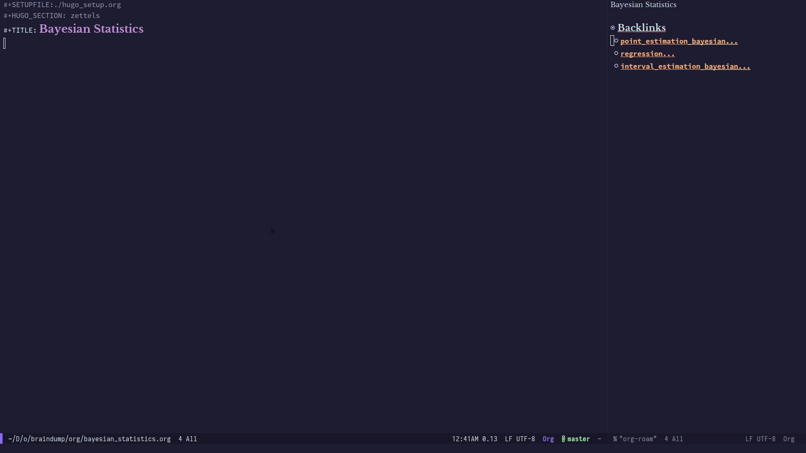

To make full use of Org-roam, you first have to understand the
note-taking flow that Org-roam encourages. This flow is modelled after
the [Zettelkasten method][zettelkasten], and many of [Roam Research]'s
workflows.

To understand more the methods and madness, the [Note-Taking
Workflow][appendix:ntw] page contains a page of useful references.

All of this starts from the note. A note is just a simple `.org` file
in the directory. Any org file in the directory is considered part of
the org-roam ecosystem. Notes are quickly linked together (and created
if necessary) using `org-roam-insert`.

Org-roam tracks all of these file links, and builds a cache
asynchronously in the background. This cache is used to populate the
backlinks buffer, which shows files that link to the current file, as
well as some preview contents:

These file links also form a graph. The generated graph is navigable
in Emacs.

[zettelkasten]: https://zettelkasten.de/
[appendix:ntw]: notetaking_workflow.md
