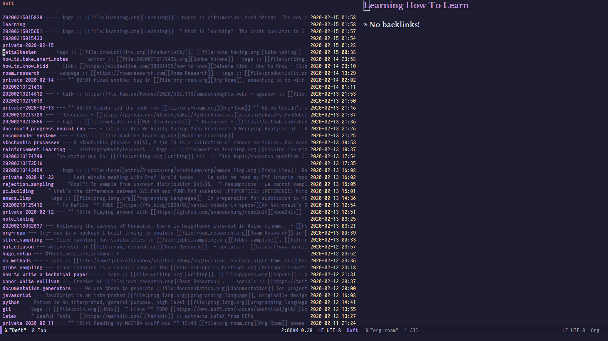

Org-roam was built to support a workflow that was not possible with
vanilla Org-mode. This flow is modelled after the [Zettelkasten
method][zettelkasten], and many of [Roam Research][roam]'s workflows.
It is crucial to understand that Org-roam does not auto-magically make
note-taking better -- it's changing the note-taking workflow that
does.

To understand more about the methods and madness, the [Note-Taking
Workflow][appendix:ntw] page contains a page of useful references. The
author has also written [a post][jethro-blog-post] about how he uses
Org-roam.

## Activating Org-roam

Org-roam's entry point is the global minor `org-roam-mode`. This sets
up Emacs with several hooks, for keeping the org-roam cache
consistently updated, as well as showing the backlinks buffer. 

The cache is a sqlite database named `org-roam.db`, which resides at
the root of the `org-roam-directory`. Activating `org-roam-mode`
builds the cache, which may take a while the first time, but is
generally instantaneous in subsequent runs. To build the cache
manually again, run `M-x org-roam-db-build-cache`.

## Finding a Note

`org-roam-find-file` shows the list of titles for notes that reside in
`org-roam-directory`. Selecting a note title will bring you to the
corresponding note. Entering a title of a note that does not yet exist
will create a new note with that title.

Note that in the above image, the [ivy](https://github.com/abo-abo/swiper)
completion frontend is used. The default frontend has some usability issues with
non-matching candidates (e.g. when you want to enter a title of a new note,
there is no completion candidate), so either `ivy` or `helm` is recommended.

## Inserting Links

`org-roam-insert` insert links to existing (or new) notes. Entering a
non-existent title will also create a new note with that title.

Good usage of Org-roam requires liberally linking files. This allows
the build-up of a dense knowledge graph.

## The Org-roam Buffer

The Org-roam buffer is often displayed in the side window. It shows
backlinks for the currently active Org-roam note, along with some
surrounding context.

## Exporting the Graph

Org-roam also uses Graphviz to generate a graph, with notes as nodes,
and links between them as edges. The generated graph can be used to
navigate to the files, but this requires some additional setup
described in the [Roam Protocol][appendix:roam-protocol] page.

[zettelkasten]: https://zettelkasten.de/
[appendix:ntw]: notetaking_workflow.md
[appendix:roam-protocol]: roam_protocol.md
[roam]: https://www.roamresearch.com/
[jethro-blog-post]: https://blog.jethro.dev/posts/how_to_take_smart_notes_org/
